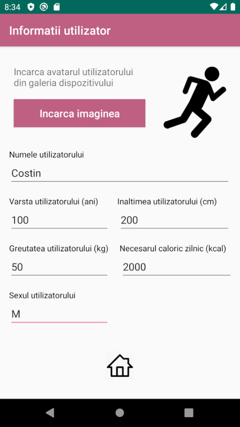
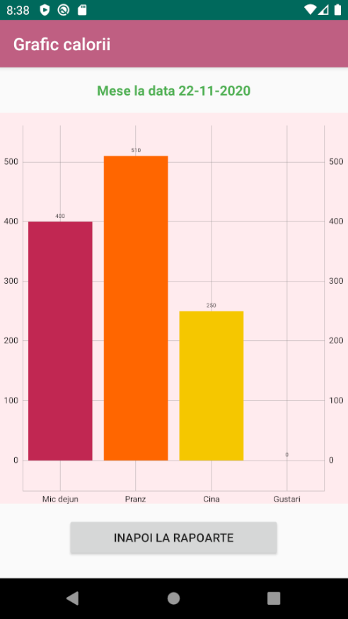

## Android app for managing calorie intake-uptake

The project is made with Android Studio using Java. The app can be used to manage calories from meals and physical exercise. All database operations (CRUD) are available. Also the app can communicate to a REST API and can also connect to Google’s Map API. 
For persistence I used <b><i>android.database.sqlite.SQLiteDatabase</i></b> class for managing SQLite data access but also Androids SharedPreferences.

App design was made for 1080x1920 420dp (I used a Pixel XL emulator)

**Screenshots:**  

